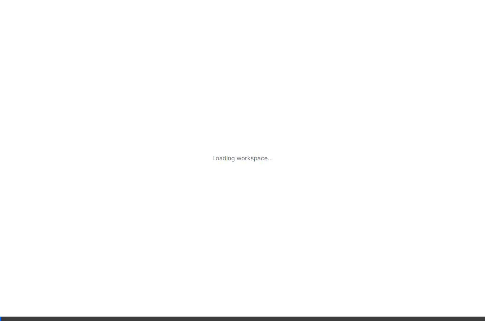
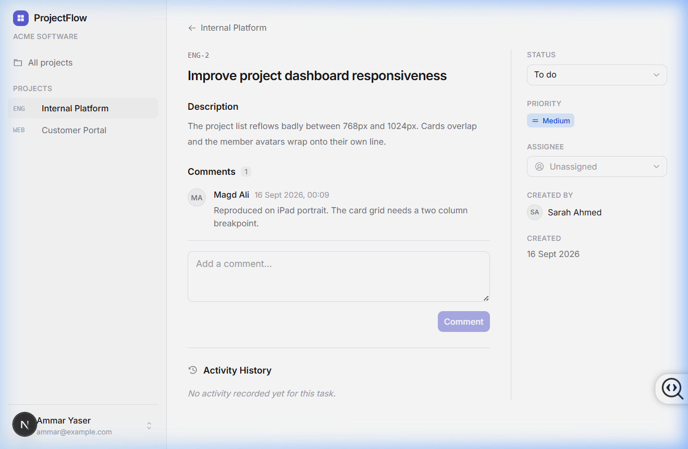
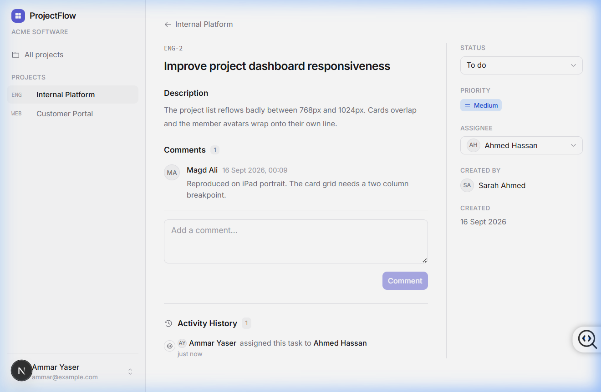
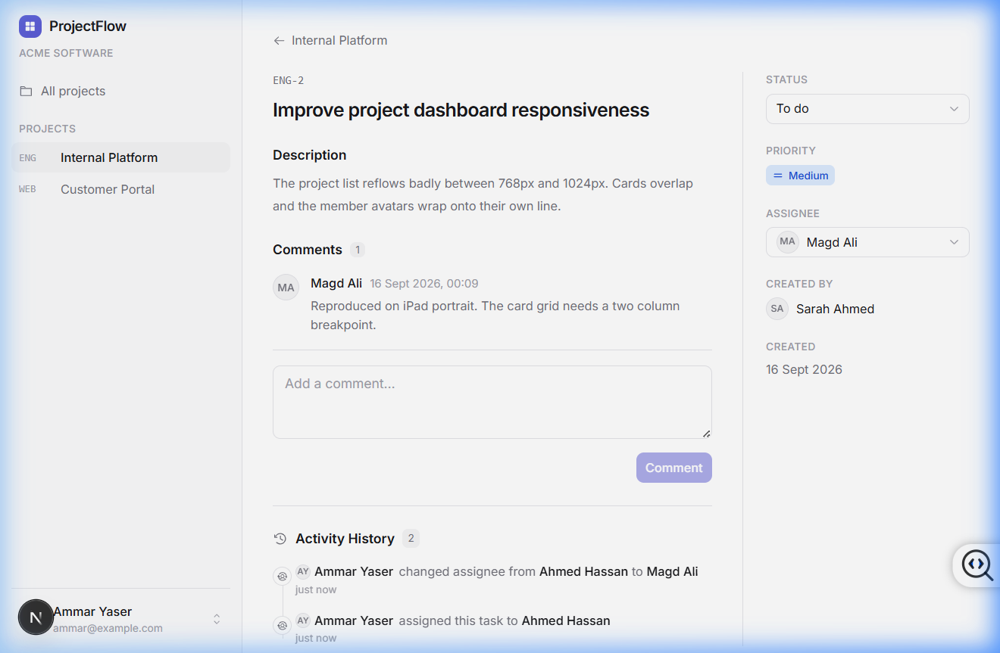

# ProjectFlow

ProjectFlow is a lightweight project and task tracker for software teams.
Organizations own projects, projects own tasks, and tasks carry a status, a
priority, assignees, an activity audit log, and a discussion thread.

It is a TypeScript monorepo: a NestJS + MongoDB API and a Next.js App Router
frontend, sharing a package of domain types, contracts, and enums.

---

## Assessment Submission Highlights

This repository contains the completed **Engtechno Full-Stack Developer Intern Assessment** by **Mohamed Hany Ahmed Mohamed Azzam**:

- **Task Assignment Domain Feature:** Implemented `assigneeId` support with strict enforcement of all 3 business rules (project membership verification, permission validation for managers vs members, and authorized unassignment).
- **Task Activity Audit History:** Modeled `TaskActivity` collection with indexed chronological query (`taskId`, `createdAt DESC`), single-batch hydration (no N+1), and full audit trails for assignments and unassignments.
- **Frontend Components:** Created interactive `AssigneeSelector` with live search, permission-awareness, empty/loading states, optimistic updates, and rollback; integrated `ActivityTimeline` with relative timestamps and pagination.
- **Production Bug Fix (BOLA / IDOR):** Identified and resolved missing authorization in `PATCH /tasks/:taskId/status` (detailed in [`BUG_REPORT.md`](file:///./BUG_REPORT.md)).
- **Concurrency Fix:** Replaced naive `countDocuments()` numbering with atomic `ProjectCounter` sequence incrementation via MongoDB `findOneAndUpdate`.
- **Automated Test Suite:** Comprehensive test coverage in `apps/api/test/task-assignment.e2e.spec.ts` covering all 9 assessment-mandated scenarios.
- **Documentation:** Included [`ASSESSMENT_NOTES.md`](./ASSESSMENT_NOTES.md), [`BUG_REPORT.md`](./BUG_REPORT.md), [`AI_LOG.md`](./AI_LOG.md), and [`.env.example`](./.env.example).

---

## Live Demo & Interactive Walkthrough

Here is an interactive walkthrough demonstration showing the application running locally with real-time Task Assignment, Activity Timeline, and Optimistic UI updates in action:



### Key User Flows Highlighted in the Demo:
1. **Interactive Assignee Selection:** Live search filtering of project members with instant optimistic UI badge updates.
2. **Real-Time Activity Audit Trail:** Automatic generation of structured activity history (`User assigned to Member`), formatted with relative timestamps (`just now`).
3. **Reassignment & Unassignment Lifecycle:** Seamless transitions between assignees and clearing assignments with audit logging.
4. **Security & Permissions:** Enforcing project-boundary assignment rules and verified status transitions.

| Task Overview & Assignee Selector | Member Assignment & Optimistic Badge | Activity History & Audit Trail |
| :---: | :---: | :---: |
|  |  |  |

---

## Technology stack

| Area         | Choice                                           |
| ------------ | ------------------------------------------------ |
| Monorepo     | pnpm workspaces + Turborepo                      |
| Language     | TypeScript 5.9                                   |
| API          | NestJS 11, Mongoose 8, MongoDB                   |
| Auth         | JWT bearer tokens, bcrypt password hashing       |
| Web          | Next.js 16 (App Router), React 19                |
| Styling      | Tailwind CSS 4, Radix primitives, Phosphor Icons |
| Server state | TanStack Query 5                                 |
| Forms        | React Hook Form + Zod                            |
| Testing      | Jest, Supertest, mongodb-memory-server           |

---

## Prerequisites

- **Node.js 20.19+** (22 or 24 recommended)
- **pnpm 10+** — `npm install -g pnpm`
- **MongoDB 7+** running locally (or use Docker / Mongo Atlas)

On macOS:

```bash
brew tap mongodb/brew
brew install mongodb-community@7.0
brew services start mongodb-community@7.0
```

Any reachable MongoDB works — point `MONGODB_URI` wherever you like.

---

## Installation

```bash
pnpm install
```

## Environment setup

Configuration lives in a single `.env` file at the repository root; both apps read it.

```bash
cp .env.example .env
```

| Variable              | Purpose                          | Default                                 |
| --------------------- | -------------------------------- | --------------------------------------- |
| `MONGODB_URI`         | MongoDB connection string        | `mongodb://127.0.0.1:27017/projectflow` |
| `JWT_SECRET`          | Signing secret for access tokens | — (required)                            |
| `JWT_EXPIRES_IN`      | Access token lifetime            | `7d`                                    |
| `API_PORT`            | Port the API listens on          | `4732`                                  |
| `WEB_ORIGIN`          | Origin allowed by CORS           | `http://localhost:3742`                 |
| `NEXT_PUBLIC_API_URL` | API base URL used by the browser | `http://localhost:4732`                 |

The API refuses to boot if `MONGODB_URI` or `JWT_SECRET` is missing.

## Database

Make sure MongoDB is running, then load development data:

```bash
pnpm seed
```

The seed is repeatable — it clears the ProjectFlow collections and reinserts a
fresh organization, users, projects, tasks, and comments.

## Running the apps

```bash
pnpm dev
```

- Web — <http://localhost:3742>
- API — <http://localhost:4732>

Both apps deliberately avoid the usual 3000/4000 defaults so they do not clash
with other projects. To move the web app, set `WEB_PORT` in your shell and
update `WEB_ORIGIN` in `.env` to match, so CORS keeps working:

```bash
WEB_PORT=3800 pnpm --filter @projectflow/web dev
```

The API port comes from `API_PORT` in `.env`; change `NEXT_PUBLIC_API_URL` to
match if you move it.

Run one at a time if you prefer:

```bash
pnpm --filter @projectflow/api dev
pnpm --filter @projectflow/web dev
```

## From a clean checkout

```bash
pnpm install
cp .env.example .env
pnpm seed
pnpm dev
```

---

## Commands

| Command          | Description                                |
| ---------------- | ------------------------------------------ |
| `pnpm dev`       | Run the API and web app in watch mode      |
| `pnpm build`     | Build every package and app                |
| `pnpm lint`      | ESLint across the workspace                |
| `pnpm typecheck` | TypeScript project-wide, no emit           |
| `pnpm test`      | API test suite (uses an in-memory MongoDB) |
| `pnpm seed`      | Reset and reload development data          |
| `pnpm format`    | Prettier write                             |

`pnpm test` does not need an external running MongoDB — it starts a throwaway in-memory
server (`mongodb-memory-server`) for the duration of the run.

---

## Development credentials

Seeded accounts, all sharing the password `Password123!`:

| Name         | Email                 | Access                    |
| ------------ | --------------------- | ------------------------- |
| Ammar Yaser  | `ammar@example.com`   | Organization owner        |
| Sarah Ahmed  | `sarah@example.com`   | Organization admin        |
| Ahmed Hassan | `ahmed@example.com`   | Project manager on `ENG`  |
| Magd Ali     | `magd@example.com`    | Member of `ENG` and `WEB` |
| Outside User | `outside@example.com` | No organization           |

---

## Architecture

```
projectflow/
├── apps/
│   ├── api/                     NestJS API
│   │   ├── src/
│   │   │   ├── auth/            register / login / current user
│   │   │   ├── users/
│   │   │   ├── organizations/
│   │   │   ├── organization-members/
│   │   │   ├── projects/        projects + ProjectAccessService
│   │   │   ├── project-members/
│   │   │   ├── tasks/           tasks, assignment, activities, counter
│   │   │   ├── comments/
│   │   │   ├── common/          guards, decorators, filters, shared DTOs
│   │   │   └── database/seed.ts
│   │   └── test/                e2e suites and fixtures
│   │
│   └── web/                     Next.js App Router frontend
│       └── src/
│           ├── app/             routes and layouts
│           ├── components/      design system primitives + app shell
│           ├── features/        auth, projects, tasks, comments
│           ├── lib/             API client, query keys, formatting
│           └── providers/       TanStack Query provider
│
└── packages/
    ├── shared/                  enums, constants, API response types
    ├── eslint-config/           flat ESLint configs
    └── tsconfig/                base TypeScript configs
```

### Domain Model

```
User
Organization        ── OrganizationMember ── User      (OWNER | ADMIN | MEMBER)
Organization  ── Project
Project             ── ProjectMember      ── User      (PROJECT_MANAGER | MEMBER)
Project             ── ProjectCounter                  (Atomic sequential numbering)
Project       ── Task ── Comment
                 │
                 └── TaskActivity ── User (actor)
```

### API surface

```
POST   /auth/register
POST   /auth/login
GET    /auth/me

GET    /organizations

GET    /projects
POST   /projects
GET    /projects/:projectId
GET    /projects/:projectId/members
POST   /projects/:projectId/members

GET    /projects/:projectId/tasks
POST   /projects/:projectId/tasks
GET    /tasks/:taskId
PATCH  /tasks/:taskId
PATCH  /tasks/:taskId/status
PATCH  /tasks/:taskId/assign          <-- New (Task Assignment)
GET    /tasks/:taskId/activity        <-- New (Task Activity History)
DELETE /tasks/:taskId

GET    /tasks/:taskId/comments
POST   /tasks/:taskId/comments
```

Errors share one uniform shape:

```json
{
  "statusCode": 403,
  "message": "You do not have access to this project",
  "error": "Forbidden"
}
```
